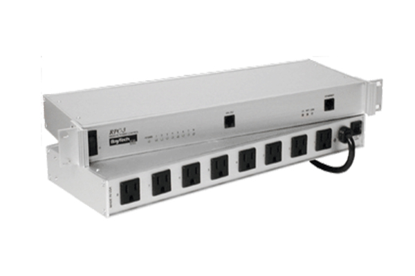

This project is used with Homebridge and the homebridge-script2 plugin.
https://github.com/pponce/homebridge-script2

homebridge-script2 allows scripts to turn outlets on/off or reboot on the RPC3Control PDU via the home app and also report state to HomeKit/Siri.

## Requirements

- Python 3
- Modern `pexpect` (tested with 4.9.x)

Install pexpect:

- Ubuntu/Debian: `sudo apt install python3-pexpect`
- Generic/pip: `python3 -m pip install pexpect`

Verify which pexpect is used:

`python3 -c "import pexpect; print(f'Version: {pexpect.__version__}'); print(f'Location: {pexpect.__file__}')"`

## `.credentials` file

The scripts read credentials from:

`/var/lib/homebridge/rpc3control/.credentials`

Both `control.py` and `state.py` call `load_credentials()` and use the returned host/user/password to open the telnet session to the RPC3.

### File syntax

The first line of `.credentials` must be:

`<rpc_host>:<username>:<password>:<whitelist_csv>`

- `rpc_host`: RPC3 IP or hostname.
- `username`: RPC3 username (leave empty if RPC3 login is disabled).
- `password`: RPC3 password (leave empty if RPC3 login is disabled).
- `whitelist_csv`: optional comma-separated values (currently parsed but not enforced by `control.py`/`state.py`).

Example (matches the sample file in this repo):

`192.168.1.2:admin::192.168.1.2`

In this example:
- host = `192.168.1.2`
- user = `admin`
- password = empty
- whitelist list = [`192.168.1.2`]

If your RPC3 does not require login, you can use empty user/password fields, for example:

`192.168.1.2:::`

### Username/password behavior at runtime

- The scripts always read `host:user:password` from `.credentials` and pass those values into `rpc3Control`.
- The username/password are only sent if the RPC3 prompt actually asks for them (`Enter username>` / `Enter password>`).
- If your RPC3 is configured to go straight to `Enter Selection>` (no login required), the script does **not** force-send username/password, and it proceeds normally.
- That means having a username present in `.credentials` (for example `admin`) is still compatible with no-login RPC3 configs.

## Example homebridge-script2 configuration

```json
            "on_off_switches": [
                {
                    "name": "RPC3 Socket 2",
                    "unique_serial": "1234562",
                    "on": "/var/lib/homebridge/rpc3control/control.py 2 admin on",
                    "off": "/var/lib/homebridge/rpc3control/control.py 2 admin off",
                    "state": "/var/lib/homebridge/rpc3control/state.py 2 admin",
                    "on_value": "true",
                    "polling": true,
                    "polling_interval": 3600000,
                    "polling_on_start": true,
                    "state_cache_ttl_ms": 1500,
                    "reset_state_cache_on_set": true,
                    "fail_on_state_exit_code": false
                },
                {
                    "name": "RPC3 Socket 3",
                    "unique_serial": "1234563",
                    "on": "/var/lib/homebridge/rpc3control/control.py 3 admin on",
                    "off": "/var/lib/homebridge/rpc3control/control.py 3 admin off",
                    "state": "/var/lib/homebridge/rpc3control/state.py 3 admin",
                    "on_value": "true",
                    "polling": true,
                    "polling_interval": 3600000,
                    "polling_on_start": true,
                    "state_cache_ttl_ms": 1500,
                    "reset_state_cache_on_set": true,
                    "fail_on_state_exit_code": false
                },
                {
                    "name": "RPC3 Socket 8",
                    "unique_serial": "1234568",
                    "on": "/var/lib/homebridge/rpc3control/control.py 8 admin on",
                    "off": "/var/lib/homebridge/rpc3control/control.py 8 admin off",
                    "state": "/var/lib/homebridge/rpc3control/state.py 8 admin",
                    "on_value": "true",
                    "polling": true,
                    "polling_interval": 3600000,
                    "polling_on_start": true,
                    "state_cache_ttl_ms": 1500,
                    "reset_state_cache_on_set": true,
                    "fail_on_state_exit_code": false
                }
            ],
            "stateless_switches": [
                {
                    "name": "Sonic Modem Reboot",
                    "unique_serial": "1111111",
                    "trigger": "/var/lib/homebridge/rpc3control/control.py 1 admin reboot",
                    "auto_reset_ms": 3000,
                    "stateless_trigger_on": "off"
                },
                {
                    "name": "UDM PM Reboot",
                    "unique_serial": "4444444",
                    "trigger": "/var/lib/homebridge/rpc3control/control.py 4 admin reboot",
                    "auto_reset_ms": 3000,
                    "stateless_trigger_on": "off"
                },
                {
                    "name": "LinuxMint Reboot",
                    "unique_serial": "5555555",
                    "trigger": "/var/lib/homebridge/rpc3control/control.py 5 admin reboot",
                    "auto_reset_ms": 3000,
                    "stateless_trigger_on": "off"
                },
                {
                    "name": "Switch10 Reboot",
                    "unique_serial": "6666666",
                    "trigger": "/var/lib/homebridge/rpc3control/control.py 6 admin reboot",
                    "auto_reset_ms": 3000,
                    "stateless_trigger_on": "off"
                },
                {
                    "name": "Switch24 Reboot",
                    "unique_serial": "7777777",
                    "trigger": "/var/lib/homebridge/rpc3control/control.py 7 admin reboot",
                    "auto_reset_ms": 3000,
                    "stateless_trigger_on": "off"
                }
            ]
```

## Notes

- `control.py` and `state.py` were written for Baytech RPC3 outlet control and for status check. 
They work great with Homebridge-script2.
- The RPC3 limits telnet sessions (typically 4), so status caching is used to reduce telnet load.
- The first state request populates/refreshes the cache file.
- If your RPC3 does not require username/password, the current scripts should work as-is.

More info on Baytech RPC3:
- http://www.copyerror.com/2014/04/25/baytech-rpc3-remote-power-controller/
- https://www.servethehome.com/baytech-rpc3-deal-remote-switched-8port-pdu-50-windows-app/
